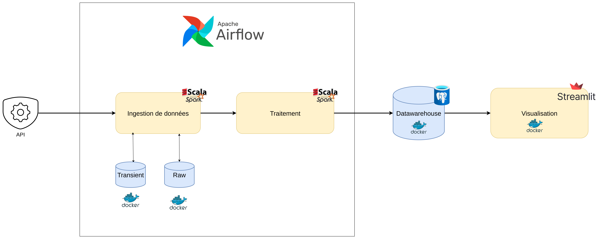

<h1 align="center">End-To-End Near Real-time Road Traffic Monitoring Solution</h1>



# Project Name

Brief description of what your project does and its main purpose.

## Table of Contents

- [Getting Started](#getting-started)
- [Prerequisites](#prerequisites)
- [Installation](#installation)
- [Usage](#usage)
- [Project Structure](#project-structure)
- [Building and Running](#building-and-running)
- [Testing](#testing)
- [Contributing](#contributing)
- [License](#license)

## Getting Started

These instructions will help you get a copy of the project up and running on your local machine for development and testing purposes.

### Prerequisites

- **Java**: JDK 17
- **Scala**: 2.13.16
- **sbt**: 1.11.3

### Installation

1. Clone the repository:
```bash
git clone git@github.com:goamegah/flowtrack.git
cd flowtrack
```

2. Install dependencies:
```bash
docker compose up -d
```

3. 