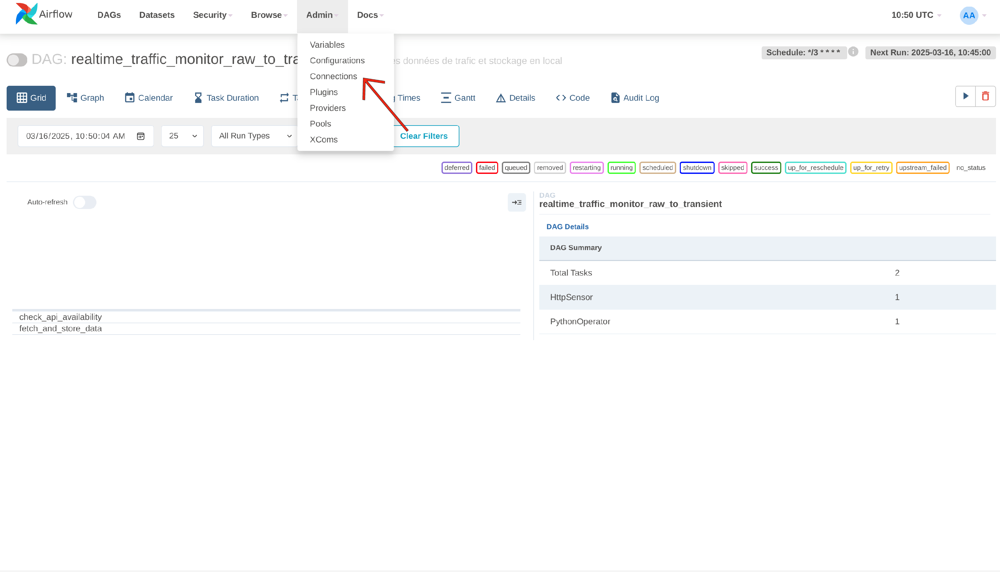
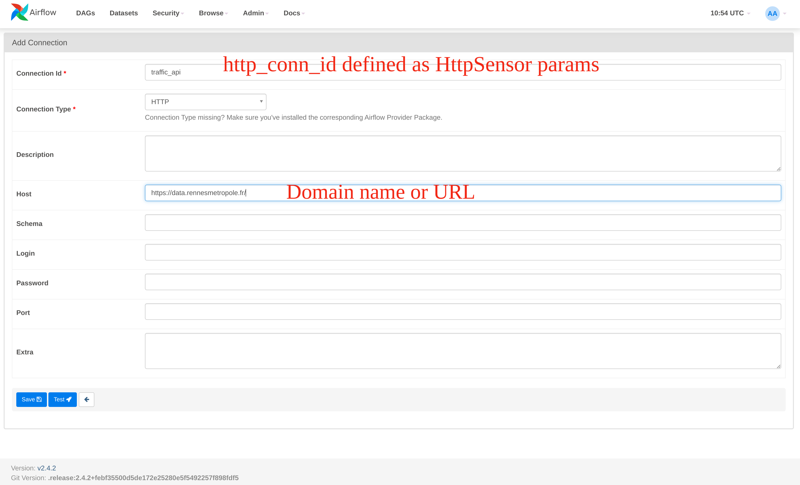
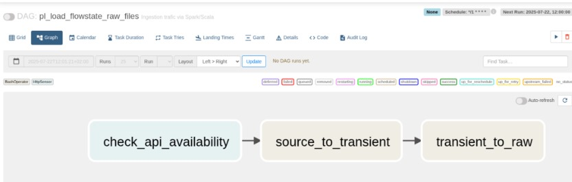
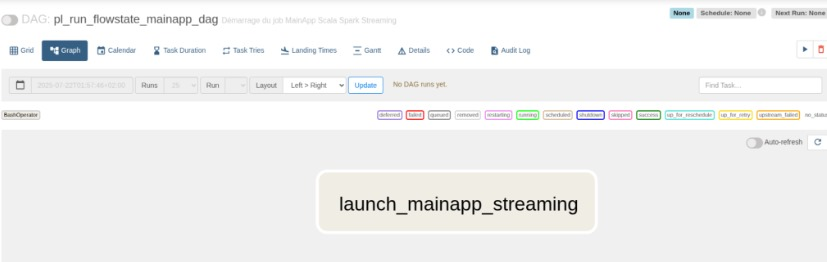
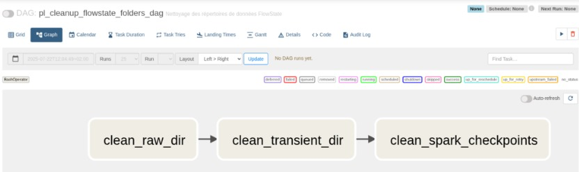
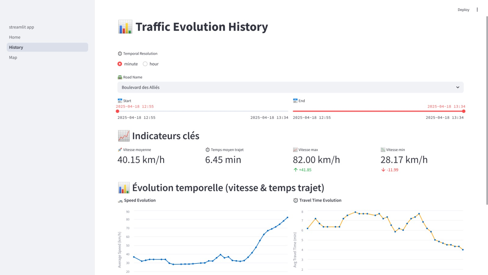

<h1 align="center">End-To-End Near Real-time Road Traffic Monitoring Solution</h1>

FlowState is a near real-time road traffic monitoring solution that leverages Apache Spark, Apache Airflow, and Docker to process and analyze traffic data. The project is designed to handle large volumes of data efficiently, providing insights into traffic patterns and conditions.
This solution is built to be scalable and robust, making it suitable for real-world applications in traffic management and urban planning.

Data is collected from the [Rennes Metropole API](https://data.rennesmetropole.fr/explore/dataset/etat-du-trafic-en-temps-reel/information/), which provides real-time traffic data. The solution processes this data to extract meaningful insights, such as traffic flow and congestion levels, and stores the results in a structured format for further analysis.

Here's reference architecture of the project:


## Table of Contents

- [Getting Started](#getting-started)
- [Prerequisites](#prerequisites)
- [Installation](#installation)
- [Usage](#usage)
- [Project Structure](#project-structure)
- [Building and Running](#building-and-running)
- [Testing](#testing)
- [Contributing](#contributing)
- [License](#license)

## Getting Started

These instructions will help you get a copy of the project up and running on your local machine for development and testing purposes.

### Prerequisites
Before you begin, ensure you have the following software installed:

- **Docker**: [Install Docker](https://docs.docker.com/engine/install/)

### Developer Setup

1. **Clone the repository**:
```bash
git clone git@github.com:goamegah/flowtrack.git
cd flowtrack
```

2. **Install dependencies**:
```bash
docker compose up -d
```

3. **Go to airflow web UI**:
```bash
http://localhost:8080
```

You well need to create a connection to the API with the following parameters:
- **Conn Id**: traffic_api
- **Conn Type**: HTTP
- **Host**: https://data.rennesmetropole.fr/





This connection is used to check the API availability

After setting up the connection, you can see following 3 DAGs that you can run one after another:
- **pl_load_flowstate_raw_files**


This DAG loads the raw data from the Rennes Metropole API into the raw folder. It is scheduled to run every 1 minutes.

In docker compose, a bind volume is mounted to display the raw files in your IDE. You can see the preview of the files in the ```shared/data/raw```  directory.

- **pl_run_flowstate_mainapp_dag**


This DAG run the main application that processes the raw data and stores the results in the data warehouse. It's not scheduled to run automatically, you can trigger it manually from the Airflow UI.

- **[Optional] pl_clean_up_flowstate_folders_dag**: 


DAG that cleans up the data from raw, transient and checkpoint folders.

4. **Check the results in the Streamlit app web UI**:
```bash
http://localhost:8501
```

