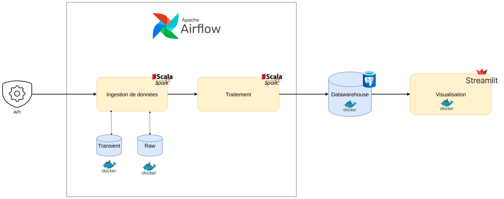

<h1 align="center">End-To-End Near Real-time Road Traffic Monitoring Solution</h1>

FlowState is a near real-time road traffic monitoring solution that leverages Apache Spark, Apache Airflow, and Docker to process and analyze traffic data. The project is designed to handle large volumes of data efficiently, providing insights into traffic patterns and conditions.
This solution is built to be scalable and robust, making it suitable for real-world applications in traffic management and urban planning.

Data is collected from the [Rennes Metropole API](https://data.rennesmetropole.fr/explore/dataset/etat-du-trafic-en-temps-reel/information/), which provides real-time traffic data. The solution processes this data to extract meaningful insights, such as traffic flow and congestion levels, and stores the results in a structured format for further analysis.

Here's reference architecture of the project:

## Table of Contents
- [Project structure](#project-structure)
- [Configuration](#configuration)
- [Data Ingestion](#data-ingestion)
- [Spark Structured Streaming Transformation](#spark-structured-streaming-transformation)
- [Data Warehouse](#data-warehouse)
- [Visualization](#visualization)
- [Orchestration](#orchestration)

-> [Project structure](docs/structure.md)