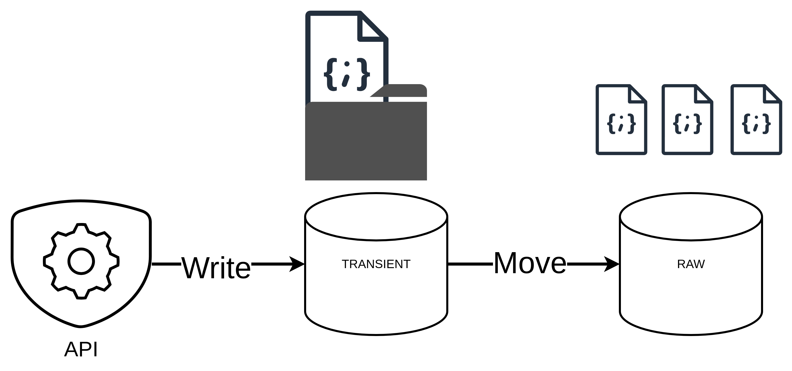
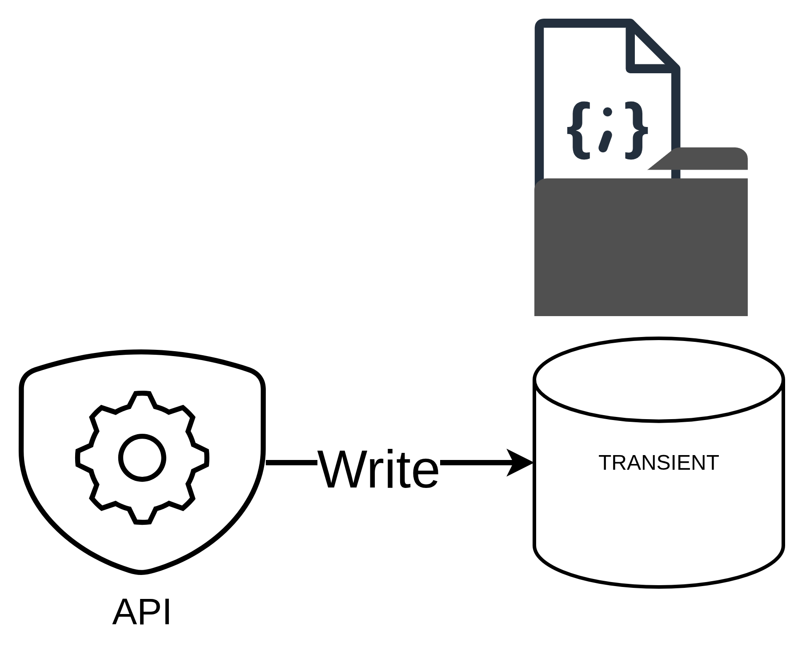
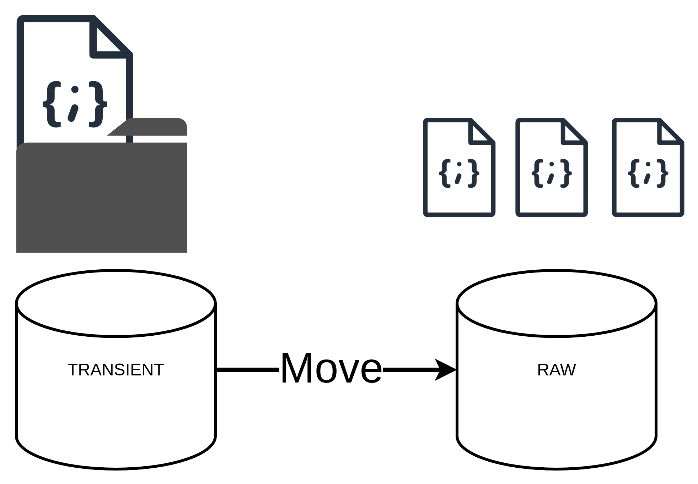

# Data Ingestion
Data ingestion is a crucial step in the FlowState project, where real-time traffic data is collected and structured. The data is sourced from the [Rennes Metropole API](https://data.rennesmetropole.fr/explore/dataset/etat-du-trafic-en-temps-reel/information/), which provides up-to-date information on traffic conditions. The ingestion process involves fetching this data, transforming it into a suitable format, and storing it for further analysis.

## Transient Data Loading
The ingestion process begins with the collection of raw traffic data from the Rennes Metropole API. This data is stored in a transient folder as JSON files folder, which serves as a temporary storage location before further processing.

## Raw Data Loading
Once the data is collected, it is moved to a raw data folder as JSON files. This step ensures that the raw data is preserved for any future reference or reprocessing needs. The raw data is structured in a way that allows for easy access and manipulation.

[Index](./configuration.md) <- -> [Configuration](transformation.md)
