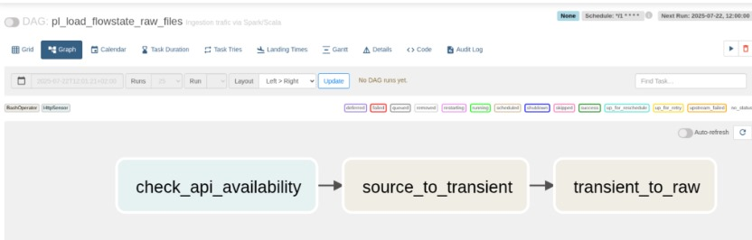
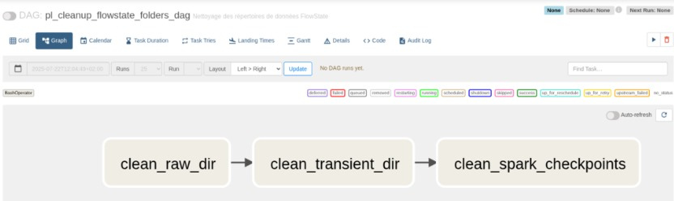

# Orchestration
<h3 align="center">
    
</h3>

Orchestration in the FlowState project is managed through **Apache Airflow**, which is used to schedule and monitor the various data processing tasks. Airflow allows for the creation of Directed Acyclic Graphs (DAGs) to define the workflow, making it easy to manage dependencies and ensure that tasks are executed in the correct order.
## Airflow DAG
The Airflow DAG for the FlowState project is defined in the `airflow/dags` directory. The DAG is responsible for orchestrating the data ingestion, transformation, and storage processes. It includes tasks for:
- Fetching data from the Rennes Metropole API to raw data storage.
- Running Spark Structured Streaming Main job to process the raw data.
- Cleaning folders like `raw`, `transient`, and `checkpoint`.

### Load Raw File 

This DAG is defined in the `airflow/dags/pl_load_flowstate_raw_files.py` file. It is responsible for fetching the raw traffic data from the Rennes Metropole API and storing it in a raw data storage location. The DAG is scheduled to run at regular intervals to ensure that the data is always up-to-date.

### Run Spark Structured Streaming Main Job

This DAG is defined in the `airflow/dags/pl_run_flowstate_mainapp.py` file. It is responsible for running the Spark Structured Streaming Main job to process the raw data stored in the raw data storage location and store the processed data in the data warehouse (Postgres). The DAG must be run once.

### Clean Folders
This DAG is defined in the `airflow/dags/pl_clean_folders.py` file. It is responsible for cleaning up the raw, transient, and checkpoint folders.
