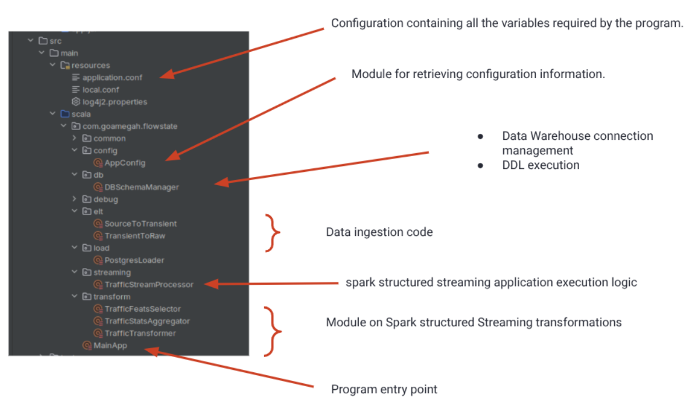

# Project Structure
FlowState is organized into several key components, each responsible for a specific part of the traffic monitoring solution. Below is an overview of the project structure:

```plaintext
src
├── main
│   ├── resources
│   │   ├── application.conf
│   │   ├── local.conf
│   │   └── log4j2.properties
│   └── scala
│       └── com
│           └── goamegah
│               └── flowstate
│                   ├── common
│                   │   ├── LoggerHelper.scala
│                   │   └── SparkSessionProvider.scala
│                   ├── config
│                   │   └── AppConfig.scala
│                   ├── db
│                   │   └── DBSchemaManager.scala
│                   ├── debug
│                   │   └── MainAppDebug.scala
│                   ├── elt
│                   │   ├── SourceToTransient.scala
│                   │   └── TransientToRaw.scala
│                   ├── load
│                   │   └── PostgresLoader.scala
│                   ├── MainApp.scala
│                   ├── streaming
│                   │   └── TrafficStreamProcessor.scala
│                   └── transform
│                       ├── TrafficFeatsSelector.scala
│                       ├── TrafficStatsAggregator.scala
│                       └── TrafficTransformer.scala
└── test
    └── scala
```

In the picture below, you can see each module and its purpose:




## Key Components
- **src/main/resources**: Contains configuration files and properties for the application.
- **src/main/scala/com/goamegah/flowstate**: Contains the main application code, organized into several packages:
  - **common**: Contains utility classes for logging and Spark session management.
  - **config**: Contains the application configuration class.
  - **db**: Contains classes for managing the database schema.
  - **debug**: Contains classes for debugging purposes.
  - **elt**: Contains classes for Extract, Load, and Transform (ELT) processes.
  - **load**: Contains classes for loading data into the data warehouse.
  - **streaming**: Contains classes for processing streaming data.
  - **transform**: Contains classes for transforming traffic data into meaningful features.


[Index](./index.md) <- -> [Configuration](configuration.md)