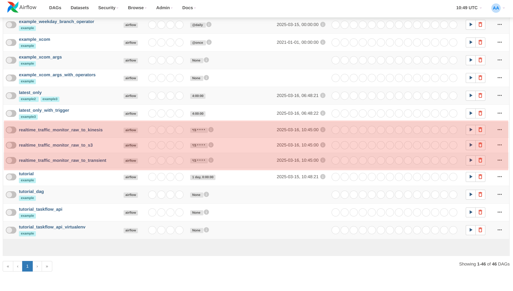
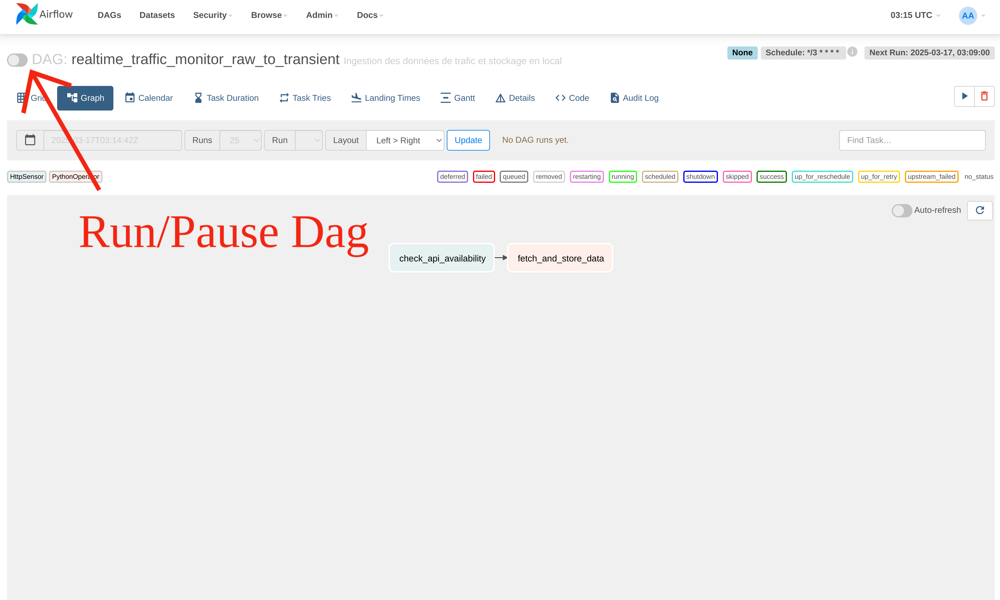

# Ingestion de données avec Apache Airflow

Cette partie du code utilise Apache Airflow pour orchestrer l'ingestion de données issues d'une [API publique](https://data.rennesmetropole.fr/explore/dataset/etat-du-trafic-en-temps-reel/information/). Les données récupérées peuvent être dirigées vers différents modes de stockage : ```AWS Kinesis```, un stockage ```local``` transitoire ou ```AWS S3```.

## Configuration

### Variables d'environnement

Les variables d'environnement sont définies dans les fichiers suivants :
- [orchestrator/dotenv.txt](dotenv.txt) : Contient un ```TEMPLATE``` de configuration de l'API, AWS et Postgres (Stockage des données de Airflow). Renseignez le au préalable, puis renommer le fichier en ```.env```.
- Le fichier d'environnement utilisé par Docker Compose est [orchestrator/.env](dotenv.txt) (si présent).

### Docker et Airflow

Le projet utilise Docker pour lancer l'environnement Airflow. La configuration se fait à l'aide des fichiers suivants :
- [orchestrator/Dockerfile](Dockerfile) : Définit l'image Docker basée sur `apache/airflow:2.6.0` et copie les DAGs ainsi que les dépendances.
- [orchestrator/docker-compose.yml](docker-compose.yaml) : Configure les services Airflow, PostgreSQL et Redis, et monte les volumes nécessaires pour les DAGs, les logs, et les plugins.

### Dépendances

Les dépendances Python pour Airflow et pour l'ingestion de données sont listées dans :
- [orchestrator/requirements.txt](requirements.txt)

## Les DAGs d'Ingestion

Le dossier [orchestrator/dags](dags) contient les trois flux d'ingestion :

1. **Kinesis** – [raw_to_kinesis.py](dags/raw_to_kinesis.py)  
   Récupère les données de l'API et les envoie vers AWS Kinesis.

2. **Stockage local (Transient)** – [raw_to_transient.py](dags/raw_to_transient.py)  
   Récupère les données de l'API et les stocke sous forme de fichier JSON dans un répertoire local.

3. **AWS S3** – [raw_to_s3.py](dags/raw_to_s3.py)  
   Récupère les données de l'API et les envoie sur AWS S3 en format JSON.

Chaque DAG utilise un capteur HTTP ([HttpSensor](https://airflow.apache.org/docs/apache-airflow-providers-http/stable/_api/airflow/providers/http/sensors/http/index.html)) pour vérifier l’accessibilité de l’API avant de lancer la tâche principale d’ingestion.

## Installation et Exécution

### Prérequis

- Docker et Docker Compose. [Installation de Docker Engine](https://docs.docker.com/engine/install/)
- Python 3.7+. [Installation de Python](https://www.python.org/downloads/)
- Accès à Internet pour récupérer les images Docker

### Étapes d'installation

1. **Cloner le dépôt :**


   
   ```sh
   git clone https://github.com/goamegah/realtime-traffic-monitor
   cd realtime-traffic-monitor/orchestrator
   ```

2. **Configurer les variables d'environnement :**

Modifier orchestrator/dotenv.txt avec vos paramètres pour l'API, AWS et Postgres.

3. **Démarrer les services :**
avant ça: 
J’ai tenté d’installer sbt directement dans Docker, mais c’était galère avec les clés GPG et les dépôts qui plantaient. Du coup, le plus simple : installez sbt en local sur votre machine, et Airflow l’utilisera depuis là:

-curl -s "https://get.sdkman.io" | bash
source "$HOME/.sdkman/bin/sdkman-init.sh"
sdk install sbt


```sh
docker compose up -d --build
```

4. **Accéder à l'interface Airflow :** Ouvrez votre navigateur et allez sur http://localhost:8080.
Utilisez les identifiants ci-dessous par défaut pour vous connecter.

```dockerfile
usr: airflow
pwd: airflow
```
5. **Accéder à l'application Streamlit :**
Ouvrez votre navigateur et allez sur http://localhost:8501 pour accéder à l'interface de l'application Streamlit.

6. [Optionnel] **Arrêter les services :**

```bash
docker compose down
```

### Configuration et lancement des DAGs Airflow

1. **Accéder** au menu de connexion


2. **Définisser une connexion HTTP** vers le nom de domaine du site de l'API et enrégistrer.


3. **Visualiser vos DAGs**


4. **Démarrer un Dags :** Exemple de raw_to_transient


#### **/!\ Point de vigilance**
Dans le cas des dags :
- **raw_to_s3**, assurer vous d'avoir votre compartiment S3 disponible ainsi que vos clés AWS
- **raw_to_kinesis** assurez-vous d'avoir d'avoir déjà créer au préalable votre espace Kinesis (kafka managé d'AWS) ```Kinesis stream```. Dans ce code, cet espace est nommé **taffic_stream** comme définis dans les variables d'environnement ```.env```. 

5. Au bout de quelques minutes vous devriez voir apparaitre en local dans le dossier ```orchestrator/data``` vos données au format JSON
```[filename]_[timestamps].json```. 


